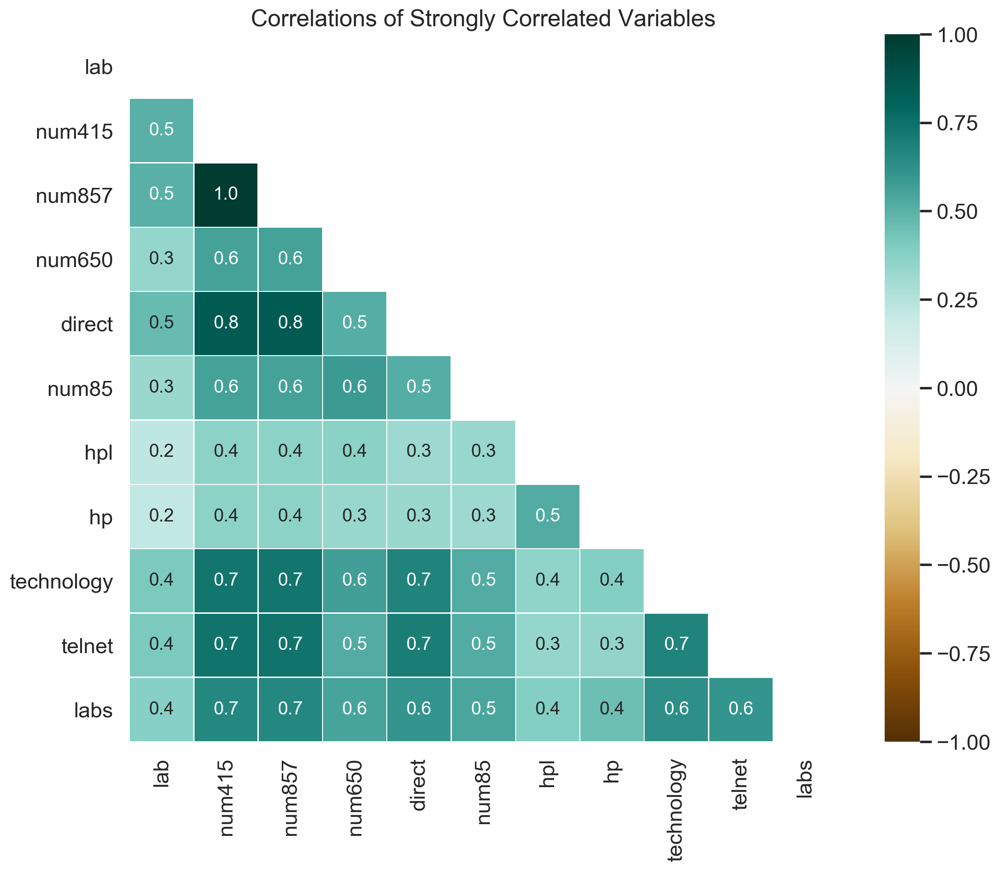
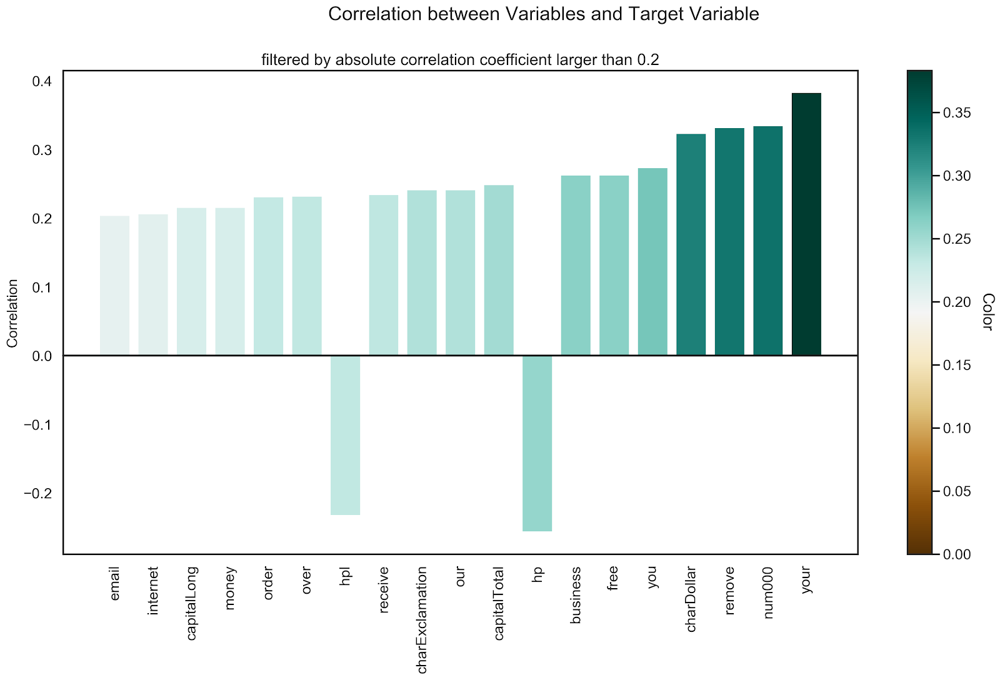
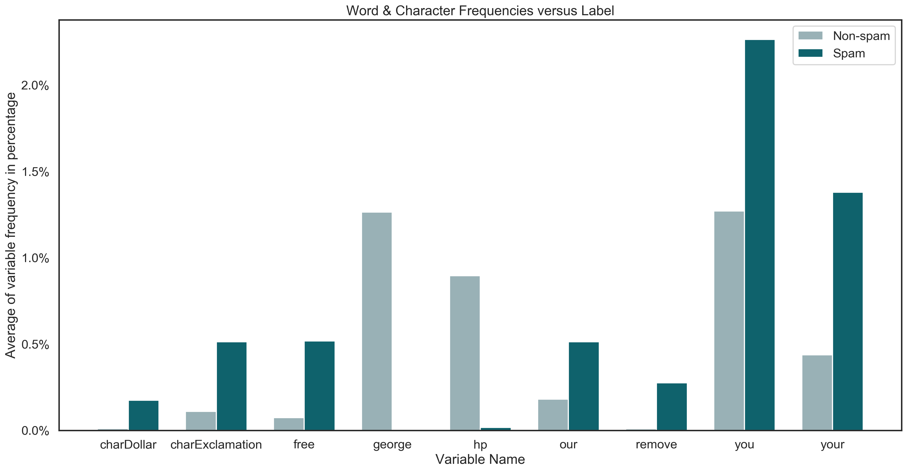

# Dataset

The dataset was taken from the [UCI Machine Learning Repository](http://archive.ics.uci.edu/ml){target=_blank}. It contains information about the content of emails, i.e., occurrences of words and special characters and information about the frequency and run-length of capital letters, as well as the binary target variable indicating whether an email is spam or non-spam \cite{Dua:2019}. The dataset includes 4601 emails and 57 features. In detail, there are:

* 48 continuous attributes that measure the frequency of specific words or numbers in the email as a fraction of total words and range from 0 to 100[%]. E.g. "free", "money", "business" or "meeting".

* 6 continuous attributes that measure the frequency of special characters as a fraction of all characters in the email. Special characters are: semicolon (`;`), round bracket (`(`), square bracket (`[`), exclamation mark (`!`), dollar sign (`$`) and hash (`#`).

* 3 continuous attributes which measure the average (`capitalAve`), longest (`capitalLong`) and total (`capitalTotal`) run-length of capital letters.

* 1 binary feature indicating the type of mail and is either `spam` or `non-spam`.

All emails in the dataset came from Hewlett-Packard (HP) employees.While spam emails came from various employees, non-spam emails were collected by George Forman, who works in Palo Alto in California (area code 650), hence the word `george` and the area code `650` are indicators of non-spam. Since the dataset contains some personalized features, it is possible to assess the effect of email personalization on spam classification.  

<figure>
  
  <figcaption>Correlations between variables with highest correlations</figcaption>
</figure>

The dataset does not include any missing feature values and around 40% of the instances have the class label `nonspam` whereas the rest is `spam`. Therefore, the dataset can be described as a rather, but not perfectly balanced dataset in terms of target variable distribution.

The correlations between features are analyzed and it can be seen that most pairs of variables have an absolute correlation coefficient between 0 and 0.5, indicating a low or negligible correlation. Therefore, only strongly correlated features, i.e., features that have at least one pair where the absolute correlation is 0.5 or higher, are visualized above.

There it can be seen that words related to Hewlett Packard like `hp`, `hpl`, `technology`, `lab` and numbers are among the strongly correlated features. The perfect positive correlation between `num857` and `num415` might stem from successive digits of a telephone number, which likely belongs to the Hewlett Packard Headquarter and is part of an email signature.

Other than that, there are little to no correlations among the frequency of words, numbers, characters or the occurrence of capital letters.

In addition, the correlations between the variables and the target variable (indicating spam/non-spam) are analyzed and those that have a higher absolute correlation coefficient than 0.2 are visualized below.  

<figure>
  
  <figcaption>Correlations between variables and target variables ranked by coefficient</figcaption>
</figure>

In the graph above, you can see that the variables `your`, `num000`, `remove`, `charDollar`, `free`, `business` and `hp` have an absolute correlation with the target variable higher than 0.25. Some correlations, like `free` and `charDollar` are not surprising, since a common spam tactic is to promise free money, e.g. "click this link to get free 100000$!". Since some words, like `your` or `remove` are not inherently suspicious, it is interesting to analyze their impact on the prediction when proper machine learning models are used.

Furthermore, the frequency of some interesting words and characters in spam and non-spam emails is demonstrated in the graph below. With this plot, we try to get a better sense of how these highly correlated words are distributed in the emails.  

<figure>
  
  <figcaption>Word and Character frequencies in spam and non-spam emails</figcaption>
</figure>

It can be seen that personalized words like `hp` and `george` almost exclusively exist in  non-spam emails. It is interesting whether this observation will be proven with the more in-depth analysis or whether this is solely a coincidence.

Moreover, variables such as `charDollar`, `remove`, `charExclamation` and `free` exist more frequently in spam emails compared to non-spam emails.

Now, that we have a initial understanding of the dataset, we want to first build machine learning models, which can classify emails as spam or non-spam as precise as possible (see section [Modelling](model.md)) and then analyze their behaviour with interpretable machine learning methods to uncover non-obvious connections (see section [Interpretable Machine Learning](iml.md)).
