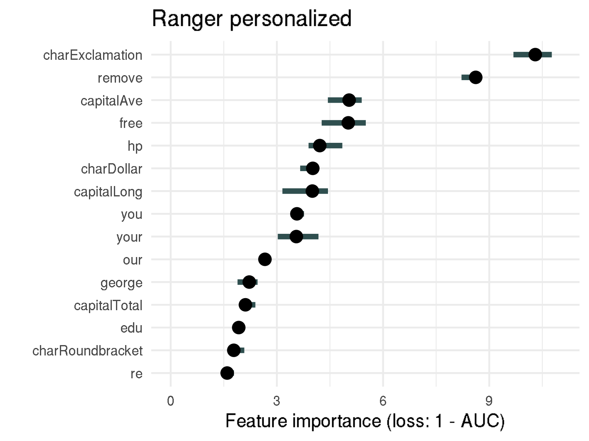
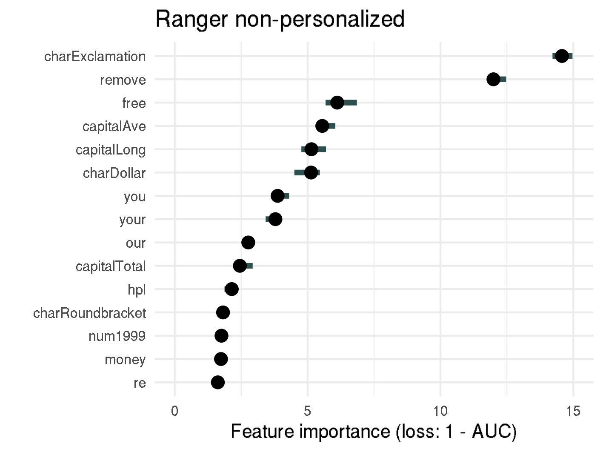
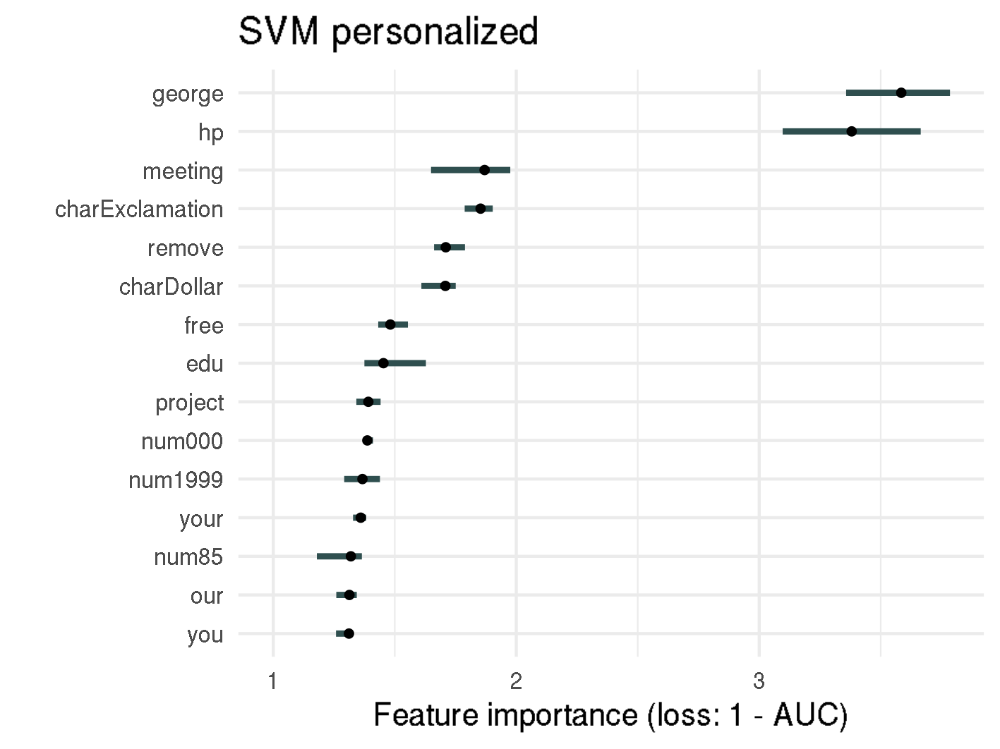
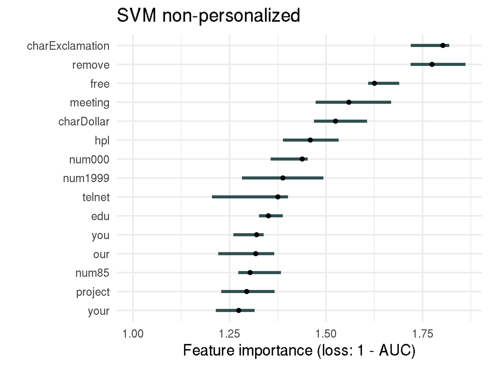
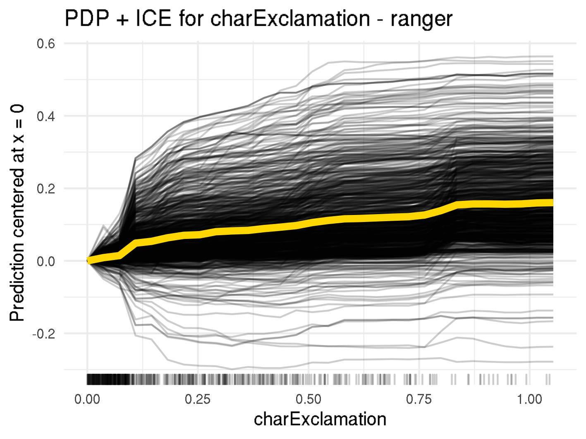
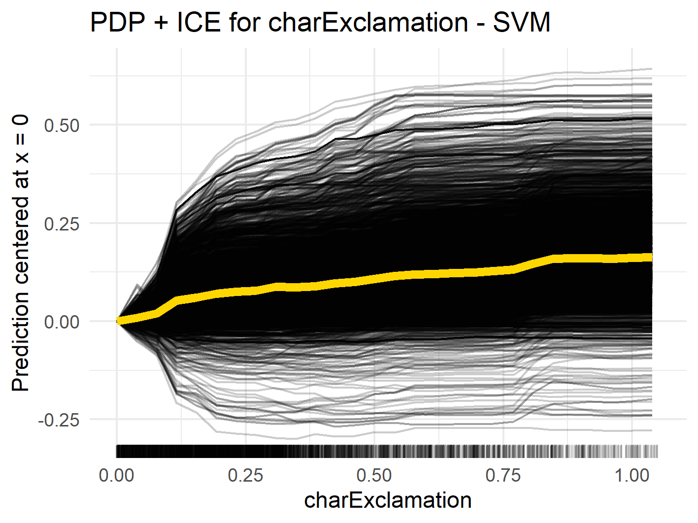

# Interpretable Machine Learning

As shown in previous sections of this report, black box models like SVM and random forest outperformed interpretable algorithms. Therefore, it is necessary to add a layer of interpretability to our analysis. Interpretable machine learning methods will help us deal with opacity of machine learning models and  explain hypotheses about attributes and their connection to the target variable.

From the scammers' point of view, our goal is to improve spam emails so that they pass spam filters. Therefore, the following questions or hypotheses are analyzed with the help of interpretable machine learning methods:

* Which measures about the frequency of words, characters or capital letters in the email should a scammer focus on? Which are the most influential ones?
* Is there a threshold for words, characters or capital letters that the scammer's email should not exceed?
* Are there combinations of words which lead to classification as spam?

More precisely,

* Do many exclamation marks lead to a classification as spam?
* Do many words in capital letters influence the prediction?
* Do some characters influence the model only within certain thresholds?
* Are there strong interactions between finance related words or characters, e.g. `free`, `money`, `credit` or `$`?

In general, our aim is to uncover interesting connections between the features and the target variable. It is also of interest if those connections differ between different model classes. E.g are the same words important for predictions in kernel-based algorithms (like SVMs) and tree-based models (like random forests)?

For this purpose, interpretable machine learning methods such as feature importance, the relationship between target and features (ICE/PDP/ALE), interactions, surrogate models and local models will be introduced and applied to black-box models.

## Feature Importance

Permutation feature importance is, as the name suggests, a method to quantify the importance of a feature. It is measured by calculating the increase in the model’s prediction error after permuting the feature of interest. We measure the prediction error for a specific model with 1-AUC so that a higher AUC leads to a lower error. Since the absolute value is not informative, the ratio between the error of the permuted model and the original model is calculated instead.

Intuitively, permuting or shuffling all values of a feature destroys any relationship between the given feature and the target. If the error increases by breaking the relationship, the given feature must have been important for model prediction.  

 
Permutation Feature Importance for random forest and SVM

Analyzing the figure above enables us to make statements about the permutation feature importance, such as:

* Permuting the proportion of exclamation marks (`!`) in an email results in a 10 times increase of 1-AUC compared to the original model, when using the personalized random forest model. For non-personalized random forest, the error increases even fifteenfold.
* The top-3 important features (`!`, `remove` and `free`) are the same for the personalized and non-personalized random forest model, as well as for the non-personalized SVM model. Considering the scammers do not know which spam filter is used, this consistency is helpful for setting up rules.
* `hp` is one of the five most important features in the personalized random forest model, with an importance of 4.4. Knowing the recipient's employer is therefore quite important for discriminating between spam and non-spam.
* The personalized words `george` and `hp` are by far the most important features for personalized SVM with a feature importance of 3.6, or 3.4 respectively. If there is the possibility to determine the recipient's name or other personal information it should be mentioned in the email as well.
* The feature importance for most features in random forest is notably higher than for SVM. This might be due to the fact that in random forests splits happen based on specific features, whereas SVMs rely on support vectors, which are specific observations and are therefore made up of all features. However statements on how to improve spam mails cannot be made.

The importance of features is quite consistent whether personalized features are included or not. Therefore, from now on, we will only apply interpretable machine learning methods on the whole dataset, i.e. the dataset including personalized variables.

## Relationship between Target & Features

Now that we know which features are important for the model's prediction, it is now of interest to understand the nature of the impact. Is there a positive or negative influence on the prediction? Is the relationship linear, monotonic, or more complex?
One method for answering these questions is to use partial dependency plots (PDP). They can be used to visualize the relationship between one or two features and the target. The partial dependence function is estimated by:

$$\hat{f}_{x_S}(x_S)=\frac{1}{n}\sum_{i=1}^n\hat{f}(x_S,x^{(i)}_{C})$$

where \(x_S\) are the features we are interested in and all other features are in \(x_C\). We basically average the prediction for a specific value of \(x_S\) over all instances and obtain marginalized effects by this way.

The PDP assumes uncorrelated features, since there would be highly unlikely or even impossible feature combinations considered otherwise. Luckily features which were shown to be important in [Feature Importance](iml.md#feature-importance), show little to no correlations and we can apply this method for further insights.

If you don't plot the average effect over all instances, but instead draw a line for each observation we obtain the individual conditional expectation (ICE). ICE plots show how the instance’s prediction changes when the feature value changes. One advantage of ICE plots compared to PDP plots is that interactions can be uncovered, if the ICE-lines are not parallel, but cross each other.

In figure below you can see that as the number of `!` in an email increases, the marginal spam probability increases for both random forest and SVM. For the random forest model, there are several small jumps in the PDP curve (orange line, e.g., at 0.1 or 0.8), while for SVM it is quite smooth. This could be due to the fact that random forest models are based on certain split points for variables, while SVM is based on the distance of observations to support vectors, which is continuous. This relationship is plausible to the extent that many exclamation marks suggest a sense of urgency, which is a common tactic in spam emails.  

 
Centered ICE curves (black) and PDP (orange) for "!"

On the other hand, the presence of the word `hp` lowers the probability of spam in both the random forest and the SVM (see figure below). This is also plausible, as the knowledge of the recipient's employer shows that the email was sent from a known individual and is not spam sent to multiple people at once. Another explanation might be that the email is sent from within the company and `hp` is in the sender's email signature. In figure below you can see that for random forest there is a steep drop between 0 and 0.5. Above that, the PDP is almost flat. This indicates that the mere mention of `hp` is enough to reduce the spam probability, and flooding the email with the employer's name does not help to pass spam filters.  

 
Centered ICE curves (black) and PDP (orange) for "hp"

As the ICE curves for random forest are all parallel, we do not expect much interaction for the variables `charExclamation` or `hp`. However, if we closely look at the ICE curve for `charExclamation` in the SVM model we can see two different courses:  for some ICE lines the effect continuously increases for increasing values, whereas some lines seem almost flat for increasing values of `charExclamation`. This might indicate interactions, which will further be analyzed in [Interactions](iml.md#interactions).

As already mentioned, partial dependence plots might be misleading, if correlations among features exist.

An unbiased and less computationally intensive alternative to partial dependence plots are accumulated local effect (ALE) plots. The accumulated local effects measure the difference in prediction in a small range around the desired feature value, instead of averaging the prediction over all observations.

In the figures below you can see the ALE plots for the top 12 most important features based on permutation feature importance (see Section [Feature Importance](iml.md#feature-importance)).
In the rugs below each ALE plot it can be seen that most variables are highly right-skewed, i.e. high density in low values and little observations/low density in high feature values. When looking at `charExclamation` for example, you can see that most emails have values below 10, but there are two outliers, one close to 20 and one above 30. This makes it difficult to properly see the curve of ALE plots in the relevant areas. Thus, PDP plots above were cut off at the 0.95 quantile.  

 
Accumulated Local Effects (ALE) for random forest

 
Accumulated Local Effects (ALE) for SVM

However, it is possible to see the general direction in which a feature influences the prediction. For random forest, most features have a positive influence on the spam probability. For the features `charExclamation`, `remove`, `free`, etc. we see that the average prediction is below zero at feature values of zero and quickly increases as the feature values increase. This shows that when those words are  common in an email the spam probability increases. The only word that lowers spam probability is `george`.

When we now look at the ALE plots for SVM, we make slightly different observations. The three most important features/words rather shift the prediction for an email towards non-spam, whereas in random forest the top four words indicate spam. The words/characters that suggest spam in SVM, like `charExclamation`, `remove`, `charDollar` and `free`, initially increase the average predicted spam probability. The ALE sharply drops into negative areas at higher values. However, this should not be too relevant for the actual predictions, since almost no emails contain such a high amount of these words/characters.  We can therefore conclude that increasing the word or character count for `charExclamation`, `remove`, `charDollar` and `free` by a reasonable amount increases the spam probability and scammers need to be careful when using those words/characters in their spam mail.

## Interactions

To analyze whether the effect of one feature depends on the value of another feature, we will consider feature interactions.

A measurement called H-statistic, which was introduced in [this article](https://projecteuclid.org/journals/annals-of-applied-statistics/volume-2/issue-3/Predictive-learning-via-rule-ensembles/10.1214/07-AOAS148.full){target=_blank}, can be used as an estimate for interaction strength. The H-statistic measures the share of the prediction function's variance that is explained by the interaction and can be used to assess various kinds of interactions. H-statistics could be very helpful to answer questions like `Are there combinations of words which lead to classification as spam?`.

The H-statistic values for the overall interaction strength of a given feature to all other features can be found in f,gure below. It can be seen that the interactions in Random Forest are rather weak, where the strongest interacting word `remove` has a interaction strength of 0.15. This means that less than 15% of the variance of \(\hat{f}\) are explained by interactions.    

 
H-Statistic

Looking at the SVM, there are two features with particularly high interactions, namely `receive` and `charExclamation`. The two-way interactions for these features can be seen in figure below. There we also see that almost 100% of the total variance of \(PD_{jk}\) is explained by the interaction between `receive` and `email`.  

 
H-Statistic 2-way Interaction

Now, if we further analyze the relationship between the two variables, we see that there is a very strong positive influence on spam probability when the occurrence of `email` is low and the percentage of `receive` of all words in the email is above 2% (see figure below). However, there are only two emails with such a high occurrence of the word `receive`, and they both happen to be `spam`. Using interpretability methods, we found regions where the SVM strongly overfits, and if this model would be used in real spam filters, we would need to correct this behavior. When looking at the ALE plot in figure below, we can also verify this overfitting, since the curve is almost flat in the range between 0 and 0.5 and sharply drops afterwards.  

 
PDP for "email" and "receive", as well as ALE for "receive"

Since most H-statistics are quite low, we can say that scammers do not need to take care of interacting words and can try to minimize the spam probability for each feature independently.

## Global Surrogate Models

The general goal of using interpretable machine learning methods is to understand how predictions are formed. Therefore, perhaps the most straightforward method would be to simply estimate the model's predictions by using an inherently interpretable model. This is exactly what global surrogate models do. More specifically, they are simpler interpretable models that are trained to estimate the predictions of the non-interpretable model.

By this approach, predictions from random forest and SVM are approximated by a single classification tree with a depth of 2.

The surrogate tree for random forest can be seen in the figure below. In the first node, we subset the data based on whether `your` occurs less or more than in 0.4% of all words. If `your` makes up at most 0.4% of the words we check the value for `charDollar`. If `charDollar` is lower than or equal to 0.055%, the instance will be classified as non-spam, otherwise the email is classified as spam. On the other side of the tree, when the value for `your` is above 0.4%, the tree splits the data based on the value of `hp`. If `hp` is lower than or equal to 0.11%, the email is classified as spam, when it is higher it will be classified as non-spam. The random forest surrogate tree predicts 82.2%  of the email classes correctly and has a false positive rate of 18.6%. This suggests that the majority of predictions can be reasonably approximated by the surrogate and scammers should be aware of their use of `your`, `!` and `hp`.  

 
Random Forest Surrogate Tree

The surrogate tree for SVM slightly differs from the one for random forest (see the figure below). Just as for random forest the surrogate tree for SVM initially splits at `your`. However, the threshold is a little higher at 0.59%. The first node where the SVM surrogate differs from the random forest surrogate is when the value for `your` is below 0.59%. There we split based on the value of `num000` and not based on the fraction of `$` in the email. If `num000` is at most 0.15%, we predict an email to be non-spam, whereas the prediction is spam when `000` make up more than 0.15% of all characters. Interestingly enough, the split-rule when `your` is above 0.59% is identical to the one from random forest and emails are classified as spam if `hp` is at most 0.11% and are classified as non-spam otherwise. The SVM surrogate tree has a very similar prediction accuracy of 82.1% as the random forest surrogate tree. However, the SVM surrogate's false positive ratio is a little better with 15%. So for both models it is reasonable to use surrogate models to understand how predictions are made.

Concluding we can say that even though both trees share the first split variable the threshold is a little higher in the SVM surrogate. However, if the occurrence of `your` is above the respective thresholds both trees split equally in the next node. The decision criterion if the email does not exceed the threshold of `your` differs. The random forest surrogate relies on the variable `charDollar`, whereas the SVM surrogate splits based on `num000`. However, both variables relate to financial scams or money in the broader sens. Since both surrogate trees are quite similar, scammers should be careful when using words related to financial scams and should definitely include the companies name if they can somehow guess it from the email domain.

## Local Methods

Local methods are used to interpret the predictions of the black box model at the instance level. In our case, the goal of using local methods is to understand why the SVM or random forest models made incorrect predictions for some emails. About 40 instances are incorrectly predicted by both models. For better understanding, we will focus on two different instances:

1. One instance that is incorrectly predicted by random forest but correctly predicted by SVM.
2. One instance that is incorrectly predicted by SVM but correctly predicted by random forest.

To understand how the models made predictions for those specific emails Shapley values and Ceteris Paribus Profiles will be introduced.

Shapley values help us to measure each feature’s contribution to the prediction of an instance, more precisely they measure how much a feature contributed to the prediction compared to the average prediction. They are calculated by averaging the marginal payout or contribution for each feature. Assuming we are interested in the contribution of feature x. First, the prediction for every combination of features not including x is calculated. Then we measure the marginal contribution of x, i.e. how adding x to each combination changes the prediction. Finally, all marginal contributions are averaged and we obtain the Shapley value for feature x. Since there are many possible coalitions of the feature values, calculating Shapley values is computationally expensive.

Spam is coded as `1` and non-spam as `0`, each email which has a higher score/prediction than 0.5 will be classified as spam. We will now focus on a spam mail, which was incorrectly predicted as non-spam by random forest with a predicted value of 0.42, but correctly predicted by SVM with a prediction of 0.53 If we look at the figure below, we can see how each feature value changes the prediction from the intercept (vertical dashed line, at 0.385) either in the spam (green/positive values) or non-spam (red/negative values) direction. 0.6\% of words are `remove`, `george` is not mentioned at all and `free` makes up 0.34% of all words, all this makes the prediction move in the direction of `spam`. However, `hp` and `hpl` (which stands for Hewlett Packard Labs) make up 0.34% of words each and move the prediction in the direction of `non-spam`. As we saw in [Relationship between Target & Features](iml.md#relationship-between-target-features) and [Global Surrogate Models](iml.md#global-surrogate-models) naming the company is a strong indicator for non-spam and that is why the email was incorrectly predicted by random forest.  

 
Shapley values for a chosen spam mail which is incorrectly classified by random forest with a prediction of 0.42. The vertical dashed, blue line shows the average prediction (0.385). The green and red bars show the Shapley values for each feature value. Summing up the intercept/average prediction and all Shapley values results in the predicted value

If we now compare which features have high absolute values of Shapley values in the SVM model in figure below, we see that only the average and total run length of capital letters (`capitalAve` and `capitalTotal`) and the number of `!` (`charExclamation`) make the email seem non-spam. There are however many other words that can compensate this, like `remove`, `you` or `our`. Additionally, the longest run length of capital letters is 15 (`capitalLong`) which is quite long and therefore suspicious. Finally, SVM is able to correctly recognize this email as spam.  

 
Shapley values for a chosen spam mail which is correctly classified by SVM with a prediction of 0.53

As we can see this email was not obviously spam, as both models predicted values close to the decision threshold of 0.5. It is however important to note that scammers usually do not know which spam filter is applied by certain email providers and there is no way of knowing if the email actually reaches the potential victim. All scammers can do is to avoid obvious spam criteria and hope spam filters can be fooled.

Ceteris Paribus Profiles are identical to individual conditional expectation curves (ICE) that were introduced in [Relationship between Target & Features](iml.md#relationship-between-target-features). In summary, Ceteris Paribus profiles help us to assess how the model’s prediction would change if the value of a feature changes.

In the figure below, it can be seen that even a small increase in the occurrence of `remove`, as well as the number of exclamation marks or capital letters in the email would increase the predicted value for SVM (blue line). In the random forest model the increase in prediction would not be that substantial (light green line). Increasing the number `hp` occurs in the email would decrease the prediction for both SVM and random forest. Again, there would be a great decrease for SVM and a smaller decrease for random forest.  

 
Ceteris Paribus Profiles for a chosen spam mail

We will now consider a non-spam email, which is correctly classified by random forest with a prediction of 0.22 and incorrectly classified by SVM with a prediction of 0.52.

In the figure below representing shapley values for random forest prediction,  you can see that the occurrence of the word `edu` has a significant impact on the prediction as non-spam. The positive effect of `remove` is quite big, but cannot compensate for the negative effect of `edu`. Random forest is able to correctly classify the email as non-spam.  

 
Shapley values for a chosen non-spam mail which is correctly classified by random forest with a prediction of 0.22

Different than in random forest, `edu` is not one of the top Shapley values for SVM for this email (see figure below). Instead, the SVM focuses more on the fact that words like `will`, `hp`, `hpl` do not exist in the email.  

 
Shapley values for a chosen non-spam mail which is incorrectly classified by SVM with a prediction of 0.52

For further analysis, ceteris-paribus profiles for this instance are plotted below.  

 
Ceteris Paribus Profiles for a chosen non-spam mail

In the plot above, it can be seen that the effect of `edu` and `cs` drops more sharply in the random forest model. In this specific email, the SVM prediction changes to non-spam even for a small increase in `hp` and `will`.

## Comparison of Interpretable Methods

So far we saw that the different interpretable machine learning methods were consistent with each other concerning how certain feature values impact the prediction. PDP, or ALE plots as well as surrogate models or individual Shapley values showed that personalizing the email is an indicator for non-spam. Whereas many occurrences of exclamation marks or words like `free` or `remove` are strong indicators for spam.

Now we want to asses whether the feature importance is also consistent when using a Shapley based measure instead of permutation feature importance. For each feature, the Shapley feature importance is the mean absolute value of the Shapley values of all observations. This means that features which have high (absolute) Shapley values for many emails have a high importance in general. A comparison of both importance measures can be found in the figure below.  

 
Comparison of Feature Importance Plots for Random Forest

For both measures, the frequency of exclamation points is the most important variable for classification as spam or non-spam. In addition, the variables `hp`, `remove`, `charDollar`, `free`, and variables concerning capital letters have high values in both importance measures with only a slight change in order. Therefore, both importance measures agree with each other and we can reasonably assume that those features are essential for the random forest's prediction.

If we now want to assess the shape of the influence on the prediction we can not only look at PDP plots, but on SHAP dependence plots as well. SHAP dependence plots show the marginal effect of a feature value on the prediction, by plotting Shapley values for all emails against the respective feature value. We can therefore see for which feature values the Shapley values are positive and push the prediction to `spam` and where the Shapley values are negative and decrease the spam probability.

The marginal effect of the value of `hp` on the prediction is visualized with SHAP dependence plot and partial dependence plot in the figure below.  

 
Comparison of Feature Importance Plots for Random Forest

By looking at the shapley values figure, we see that for `hp` = 0 most Shapley values are between 0 and 0.05, which especially means they are positive and increase the spam probability. As soon as the value for `hp` increases we see a sharp drop and almost all Shapley values are between -0.05 and -0.20. Similar to the findings of the PDP plot, increasing the number of `hp` does not decrease the Shapley value in general. Many Shapley values for `hp` between 2 and 20 are around -0.05, which is the same value that is already reached at `hp` = 0.1. Again, we can confirm our findings, that mentioning the company name is enough to decrease the spam probability.
